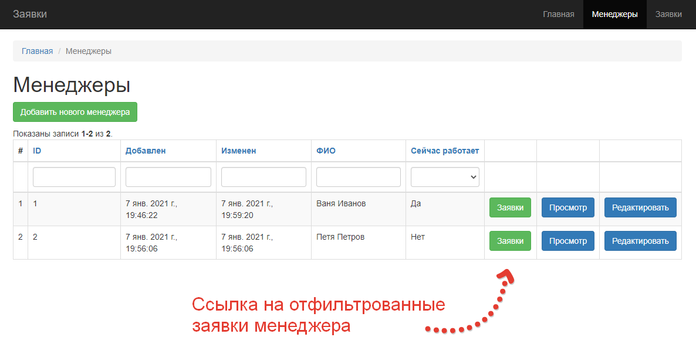
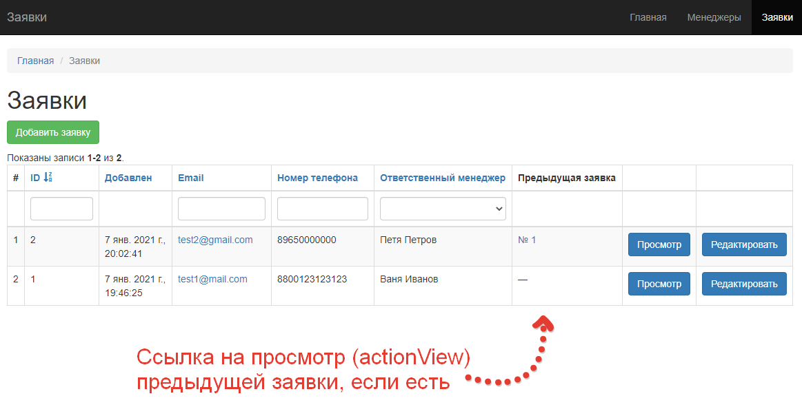

# Установка и настройка

1. Клонировать репозиторий в рабочую директорию, а также опубликовать его на своем аккаунте bitbucket / github / gitlab. В результате потребуется ссылка на Pull Request в **вашем** репозитории;
2. Установить зависимости composer;
3. Создать файл `/src/.env` и скопировать в него содержимое файла `/src/.env-example`;
4. Запустить docker-compose;
5. Установить миграции (из контейнера php-fpm);

Пункты 4 и 5 подразумевают наличие Docker. Если опыта работы с ним нет, то пример конфигурации nginx находится в файле `/docker/nginx/bc.conf`, а за подключение к базе данных (тестировалось на MySQL) отвечают следующие переменные окружения:

* DB_USERNAME - имя пользователя;
* DB_PASSWORD - пароль;
* DB_DSN - строка вида `mysql:host=` + хост базы данных + `;dbname=` + имя базы данных.

# Тестовое задание

### Введение

Данный проект используется для выполнения тестового задания, поэтому для простоты он состоит всего из двух сущностей — **менеджеры** и **заявки**. Система пользователей и прав доступа отсутствует.

Представим небольшую компанию, где есть **оператор** — человек, который принимает по телефону и/или по почте заявки от клиентов и заносит их в раздел заявок нашей системы. Также он назначает ответственного за заявку менеджера, который сейчас работает. Далее менеджеры видят в списке заявок те, которые назначили на них и работают над ними.

Когда менеджеров и заявок стало много у оператора начались проблемы — сложно вспомнить кто из менеджеров сейчас на смене и свободен.

### Задача 1

В разделе **Менеджеры** необходимо добавить столбец со ссылкой на отфильтрованную таблицу заявок, где он указан как ответственный.

### Задача 2

Необходимо определять *дубли\** заявок и добавить ссылку на предыдущую заявку на странице списка и просмотра заявки.

Если при поиске дублей найдено несколько предыдущих заявок — брать последнюю.

**Не критично, если заявка не будет отображаться в списке, пока не был произведен поиск дублей.**

*\* Дублем считается **повторная** заявка от клиента — то есть должны совпадать email или номер телефона. Не считать заявку дублем, если предыдущая создана более 30 дней назад.*

### Задача 3

Необходимо автоматизировать назначение менеджеров для заявок по следующему принципу:

1. Если заявка является дублем, и если менеджер предыдущей заявки сейчас работает, то нужно назначать на него.
2. Если заявка не является дублем или менеджер предыдущей заявки не работает, то необходимо распределять равномерно между работающими менеджерами (свойство `is_works = true`).

Для простоты считать, что хотя бы один из менеджеров **всегда** работает.

Выбор менеджера в форме редактирования заявки нужно убрать.

**Не критично, если заявка не будет отображаться в списке, пока не будет назначен менеджер.**

# Результат

Ссылка на Pull Request в ветку master.